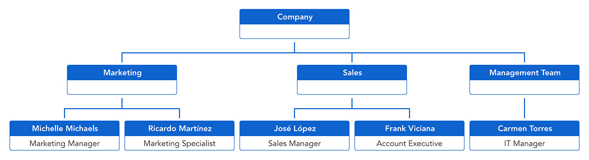

# Liferay Org Chart

Demo of an organizational chart listing organizations & users in Liferay 7.2+ using [Vue.js](https://vuejs.org).



## Configuration

Add a `.npmbuildrc` file following at the root of this project with the following content:

```json
{
  "liferayDir": "/path/to/liferay/home"
}
```

> The value needs to point to your local Liferay bundle.

You can find an `.env` file at the root of the project containing the following properties:

```properties
VUE_APP_LIFERAY_HOST="http://localhost:8080"
VUE_APP_LIFERAY_USERNAME="test@liferay.com"
VUE_APP_LIFERAY_PASSWORD="test"
```

> :warning: These settings are unsafe and provided for development purpose only. Don't use user credentials in production but OAuth2.0 authorization as described here instead: https://help.liferay.com/hc/en-us/articles/360039026192-Making-Authenticated-Requests#oauth-20-authorization.

```properties
VUE_APP_LIFERAY_EXCLUDED_NAMES=liferay,admin
```

> A comma separated list of names which should be excluded from the chart. So here, by default, any user with `liferay` or `admin` in the `fullName` won't be displayed on the organizational chart. The same goes for organization names.

```properties
VUE_APP_ORG_CHART_OPTS_PAN=false
VUE_APP_ORG_CHART_OPTS_ZOOM=false
VUE_APP_ORG_CHART_OPTS_ZOOMIN_LIMIT=7
VUE_APP_ORG_CHART_OPTS_ZOOMOUT_LIMIT=0.5
```

> More information about thoses settings here: https://github.com/dabeng/vue-orgchart.

If you want to use this application as a standalone, you may need to configure CORS in Liferay. More informations here: https://help.liferay.com/hc/en-us/articles/360030377272-Configuring-CORS.

## Usage

Install:

```shell
yarn install
```

Lints and fixes files:

```shell
yarn lint
```

Compiles and hot-reloads for development:

```shell
yarn serve
```

Compiles and minifies:

```shell
yarn build
```

Compiles and minifies for Liferay:

```shell
yarn build:liferay
```

## License

[MIT](LICENSE)
